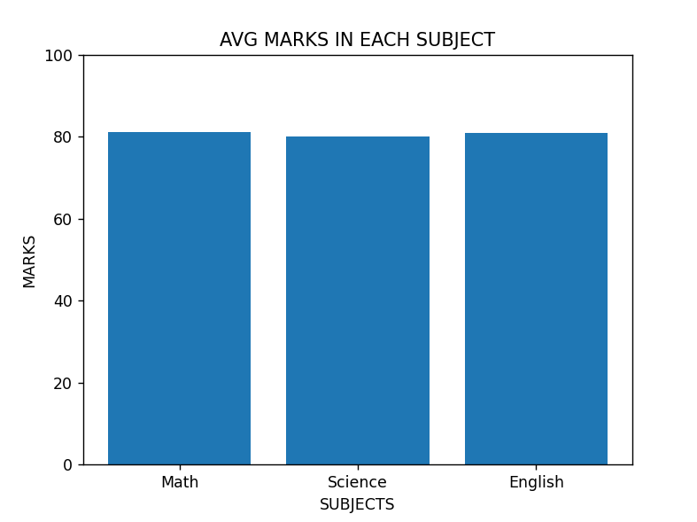
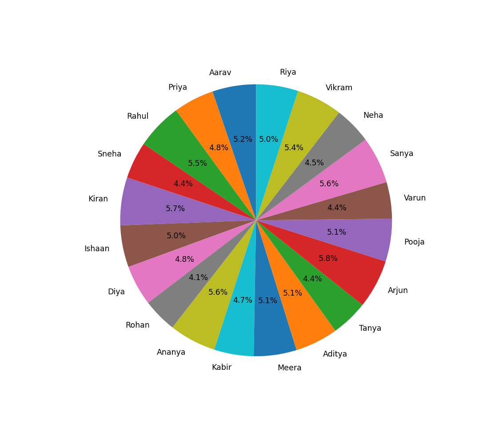

# 🎓 Student Performance Data Analysis using Python

## Project Overview

This project is a comprehensive **data analysis pipeline** built in **Python** using core libraries like **Pandas**, **NumPy**, and **Matplotlib**. The goal is to analyze a dataset of student performance, compute key statistical metrics, identify top performers, and visualize insights through clean, professional charts.

---

## Table of Contents

* [📊 Features](#-features)
* [🧠 Concepts Covered](#-concepts-covered)
* [🖼️ Visualizations](#-visualizations)
* [⚙️ How to Run the Project](#️-how-to-run-the-project)
    * [Prerequisites](#prerequisites)
    * [Running the Script](#running-the-script)

---

## 📊 Features

The `analysis.py` script performs the following operations on the student data:

* **Data Import:** Reads student data from a specified CSV file.
* **Statistical Computation:** Calculates the **maximum, minimum, and average marks** for each subject.
* **Performance Metrics:** Computes the **total marks per student**.
* **Top Performer Identification:** Identifies and highlights the **top-performing student** based on total marks.
* **Data Ordering:** Sorts the entire dataset based on students' **total marks** in descending order.
* **Conditional Filtering:** Filters and displays students who scored **above the average mark in the Math subject**.
* **Data Visualization:** Creates two key charts for insightful analysis:
    * **Bar Chart** — Showing the average marks achieved per subject.
    * **Pie Chart** — Illustrating the total marks distribution across all students.
* **Data Export:** Exports the final, processed data (including total marks) into a new CSV file named `students_updated.csv`.

---

## 🧠 Concepts Covered

This project is an excellent demonstration of fundamental data science skills in Python:

* **Data Handling and Manipulation:** Proficient use of **Pandas** for structuring, cleaning, and transforming data in DataFrames.
* **Numerical Computations:** Leveraging **NumPy** for efficient array operations and statistical calculations.
* **Data Visualization:** Generating informative and professional plots using **Matplotlib**.
* **I/O Operations:** Handling standard CSV file import and export procedures.
* **Analytics Fundamentals:** Implementing sorting, filtering, and basic aggregation functions for actionable insights.

---

## 🖼️ Visualizations

The script generates the following two visualizations:

### 📈 Average Marks per Subject *(Bar Chart)*
This chart provides a quick comparative view of performance across different subjects.



### 🍰 Total Marks Distribution *(Pie Chart)*
This chart illustrates how the total aggregate marks are distributed proportionally among the student body.



---

## ⚙️ How to Run the Project

### Prerequisites
You need a working Python installation (`3.6+` is recommended) and the following libraries and then run the script:

```bash
pip install pandas numpy matplotlib
python analysis.py

